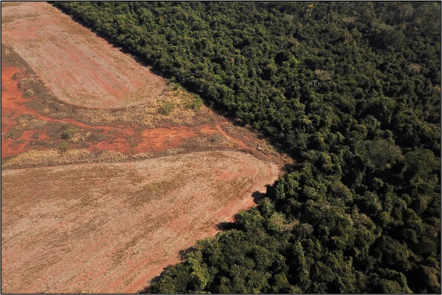
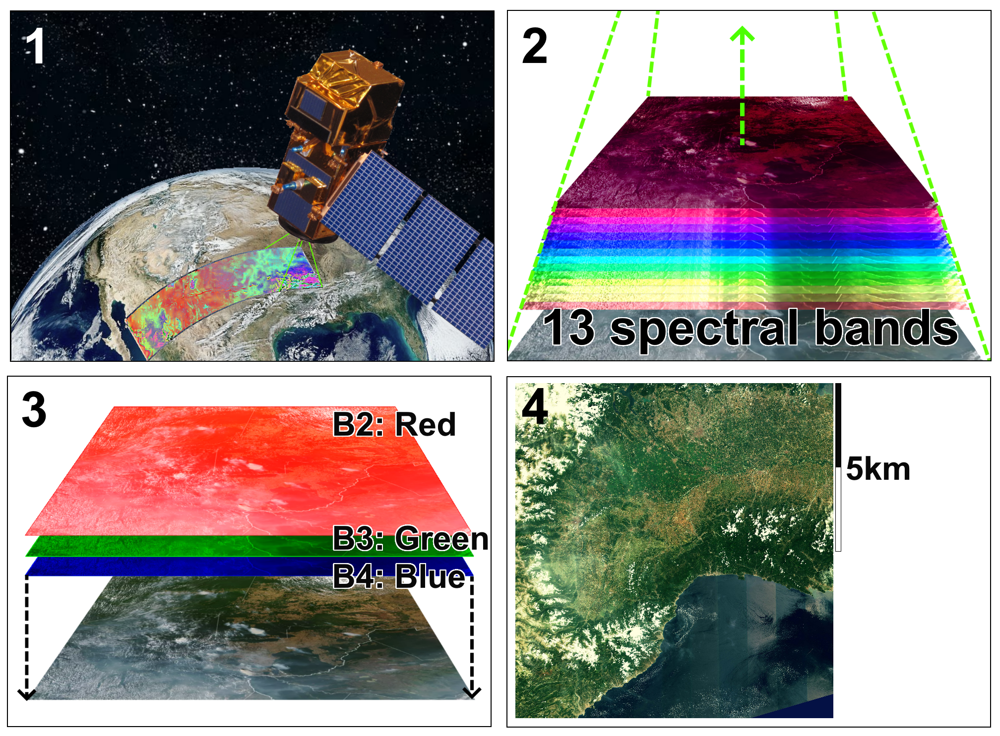
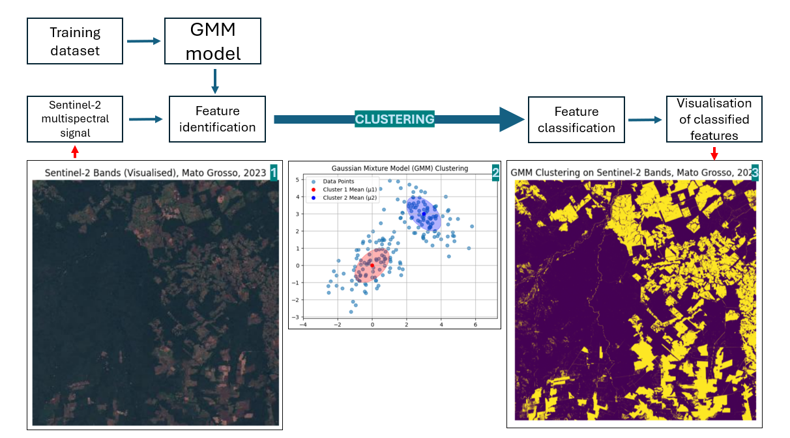

<!-- Improved compatibility of back to top link: See: https://github.com/othneildrew/Best-README-Template/pull/73 -->

<!--
*** Thanks for checking out the Best-README-Template. If you have a suggestion
*** that would make this better, please fork the repo and create a pull request
*** or simply open an issue with the tag "enhancement".
*** Don't forget to give the project a star!
*** Thanks again! Now go create something AMAZING! :D
-->

<!-- PROJECT SHIELDS -->
<!--
*** I'm using markdown "reference style" links for readability.
*** Reference links are enclosed in brackets [ ] instead of parentheses ( ).
*** See the bottom of this document for the declaration of the reference variables
*** for contributors-url, forks-url, etc. This is an optional, concise syntax you may use.
*** https://www.markdownguide.org/basic-syntax/#reference-style-links
-->

<!-- PROJECT LOGO -->
 

  

<h3 align="center">Tackling Illegal Deforestation with Remote Sensing and Artificial Intelligence</h3>

  

    This project seeks to use Sentinel-2 satellite data to assist local authorities in the quantification and identification of deforestation in regions of the Brazilian Rainforest, using a case study of the Mato Grosso municipality.  
     
     
    <a href=https://github.com/JohnRuskinONLINE/GEOL0069-Final-Project-JRO"><strong>Explore the doc! »</strong></a>
     
     
  

<!-- ABOUT THE PROJECT -->
## About The Project

Illegal logging in the Brazilian Amazon, often for exportation of timber to the USA and Europe ,is a principal driver of deforestation, a disincentive to the establishment of a sustainable forest sector   and tantamount to a crisis (Brack 2003, Gutierrez-Velez and MacDicken 2008, Reboredo 2013, Finer, Jenkins et al. 2014, Santos de Lima, Merry et al. 2018). A major obstacle facing the bodies of             enforcement, be that of police or volunteer organisations, is the identification of those spaces where illegal logging is occurring (M. Condé, Higuchi et al. 2019). Previously, geo-intelligence            utilising  medium-resolution satellites (herein defined as pixel resolution =< 30m) has been used against illegal deforestation and timber laundering in the Brazilian Amazon (Perazzoni, Bacelar-Nicolau    et al. 2020), though has historically relied on the manual trawling of data by analysts. In recent history, artificial intelligence has been applied to the mapping of roads in the Brazilian Amazon         (Botelho Jr, Costa et al. 2022) and to monitor illegal logging in the tropical jungles of Indonesia (Mujetahid, Nursaputra et al. 2023), with medium-resolution satellites. Henceforth I will describe the   utilisation of high-resolution (10m pixel resolution) satellites (Sentinel-2), the Google Colab (Google 2024) computational environment, Google Earth Engine (Google 2024), and the Copernicus Data Space    Ecosystem (European Space Agency 2024) to quantify deforestation in the Mato Grosso region of the Brazilian Amazon using computationally-light Gaussian mixture model (henceforth GMM) machine learning      algorithms to produce maps and co-ordinates of areas where illegal logging may be taking place.

It is worth noting that I did attempt to realise this project with VIT, RF, and CNN models trained with IRIS, but GMM consistently outperformed them - because of this, and its far less demanding computational strain, I selected it for this project.

  

Figure 1: Image of a recently deforested area in the Mato Grosso region of the Brazilian rainforest (Perobelli, 2021).

 

Prior to running any of the Jupityr notebooks appended to this repository, I would encourage the creation of: a Google account, for use therein of Google Colab, Google Drive, and Google Earth Engine and a Copernicus Space Database account. It will not be neccesary to have access to a 'Colab Pro' account for the running of this code. 

## Sentinel-2 
Sentinel-2 is an Earth observation mission from the Copernicus Programme that acquires optical imagery at high spatial resolution over land and coastal waters. It has a multi-spectral instrument with 13 bands, ranging from visible light to short-waved infrared and can achieve spatial resolutions of 10m. In regard to the running of this code, we are concerned with the 2nd, 3rd, and 4th band, which correspond to red, green, and blue respectively. With these three bands, each of 10m resolution, we will produce high resolution, time-stamped satellite imagery that will form the basis of our analysis. 
 

  
   
In this figure, we see Sentinel-2 passing its multi-spectral instrument over the Earth in 'tracks' (Panel 1), that align with the military grid reference system. Simply, for each grid it passes across, it measures the spectral responses for 13 optical bands (Panel 2), of these 13, the aforedescribed 3 are concatenated (Panel 3) to produce 10m resolution visualised results for every military grid reference of the planet (Panel 4). This is the data that we will be using in our subsequent analysis.
 

## Gaussian Mixture Model Clustering
Most simply, Gaussian mixture modelling (henceforth GMM) is a probabilistic model that assumes all the data points are generated from a mixture of a finite number of Gaussian distributions with unknown parameters.

  
 
Having acquired visual data (1), each pixel, with its individual RGB colour model values, is appended as raw data to an array. These features having been identified, a trained GMM model is applied. This probalistically assigns each pixel, based on factors such as hue and vicinity to similarly described pixels, to one of two classes, or clusters (2). While the number of clusters you can define is theoretically infinite, for the purposes of this analysis, it was two. Then, once these values have been assigned, they can be visualised once more to show a classified image (3). 
 

## Getting Started!
Now, having understood these two concepts we are ready to transition to our notebook, which is stored in this repository. If any additional understanding is required, below I have appended a video of myself running this code and talking through the process:

